## The Goal
See that peak on the top left? That's where we will end up. Seems like a daunting task doesn't it? That's what an old timey minister from 1916 thought too. He saw the towering rock accessible only by a narrow climb and said "Only an Angel can land here". Hence, Angel's Landing.

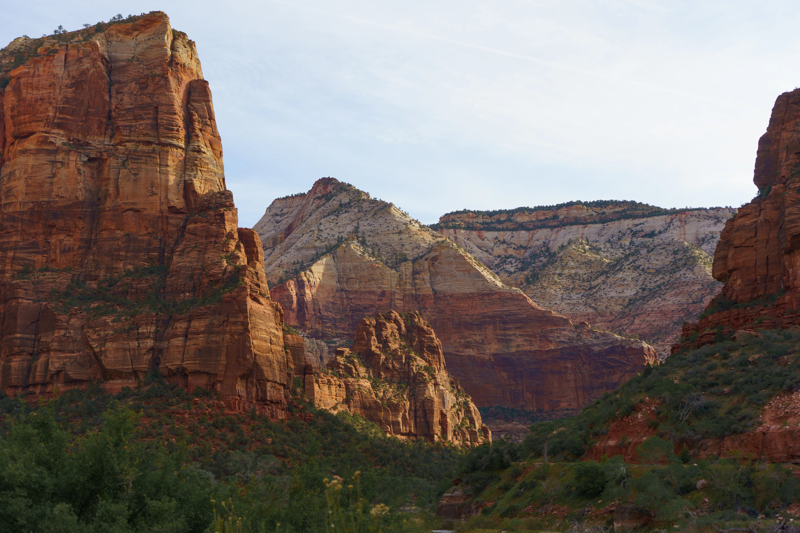

## The Path to the Spine

### Step 1 - Switchbacks
Hike the switchbacks up this near vertical rock face. You'll see the same view of the Zion Valley throughout the climb, with well placed photo spots all along the climb. Zoom in to see people climb up the switchbacks

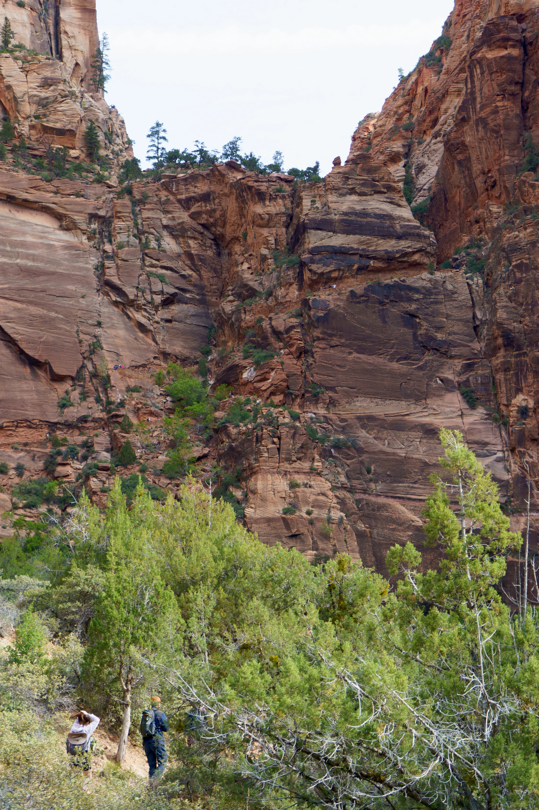

If you're in the right season, you can see cacti blooming! Look carefully at these prickly survivalists blooming, then look a bit more carefully, and then proceed to shove your alpha-male mentality up where the sun don't shine.

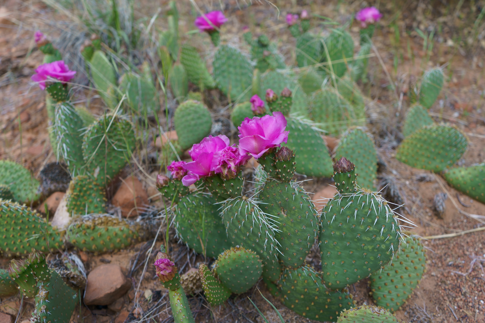

This is where you first test your fear of heights. If you are the kind of person who hugs the wall and can't go more than a foot away from the edge, then I've got bad news for you.

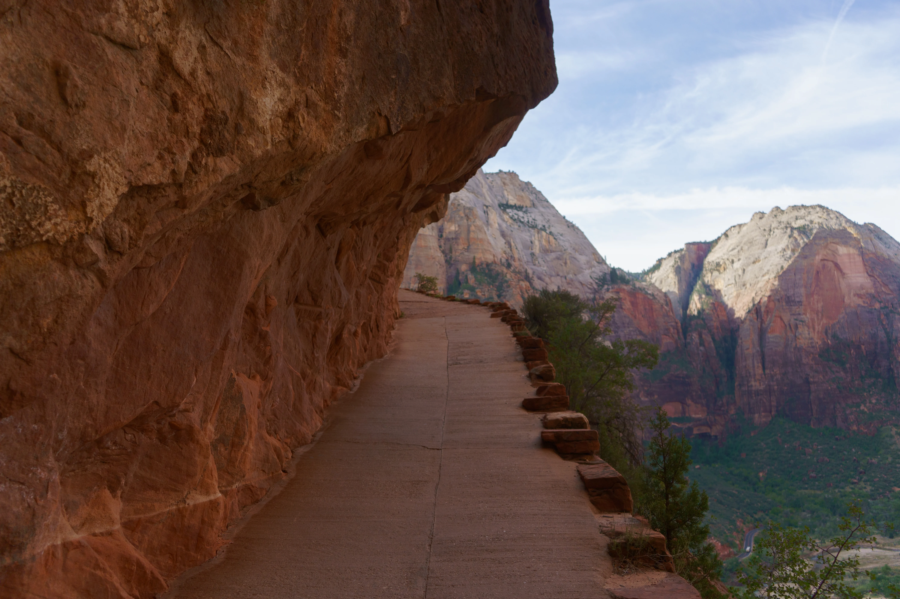

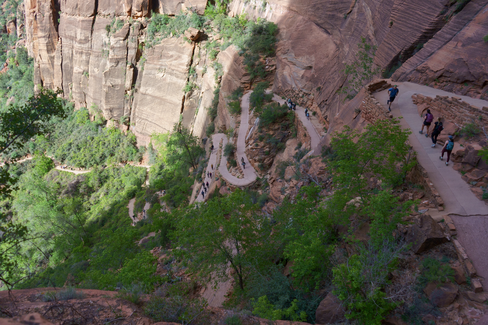

### Step 2 - Wiggle wiggle wiggle, Walter's Wiggles
A neat little ascent up another narrow and steep section, just before the start of the spine. 

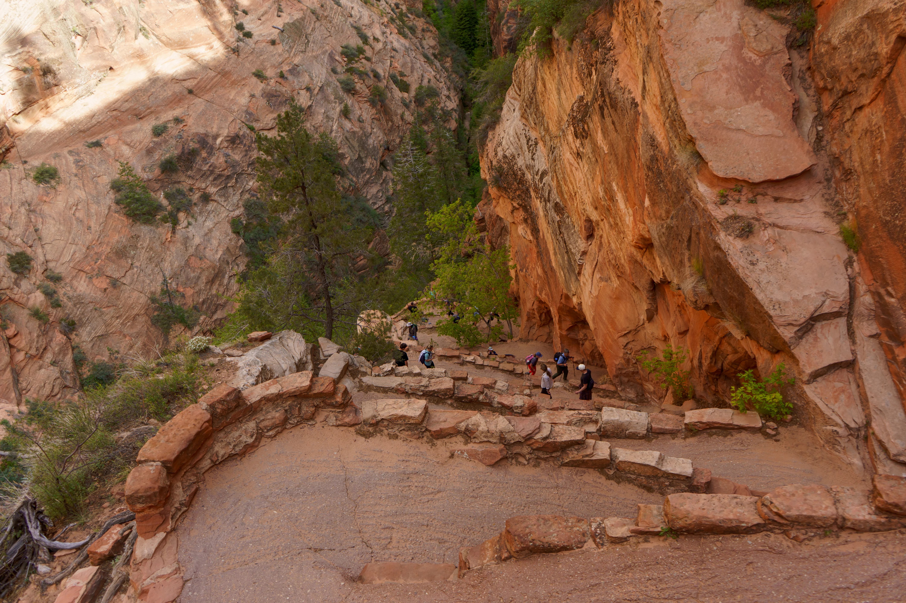

### Step 3 - Scout's Lookout
Relax, eat, use the restroom, and get your permits ready. It's about to get exciting!! This is also a great place to click some photos of the Spine itself, and decide to turn back if you have to. 

Look at them puny little humans trying their best to scale the Spine.

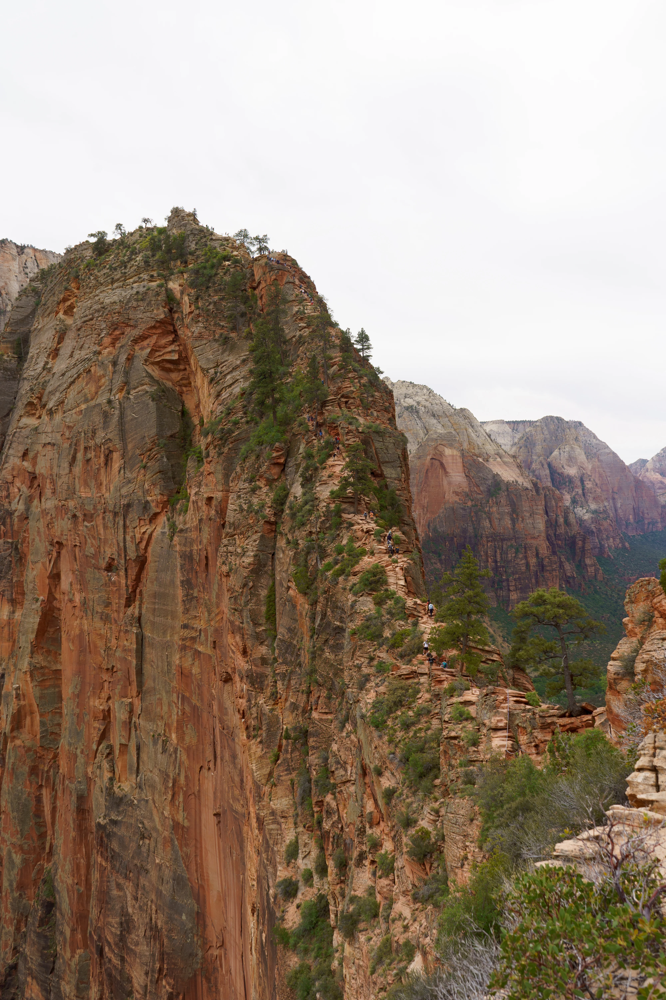

This is also an awesome place to spot condors in all their glory! My stupid hare-brain didn't switch to my zoom lens, so imagine a condor flying here ^^;

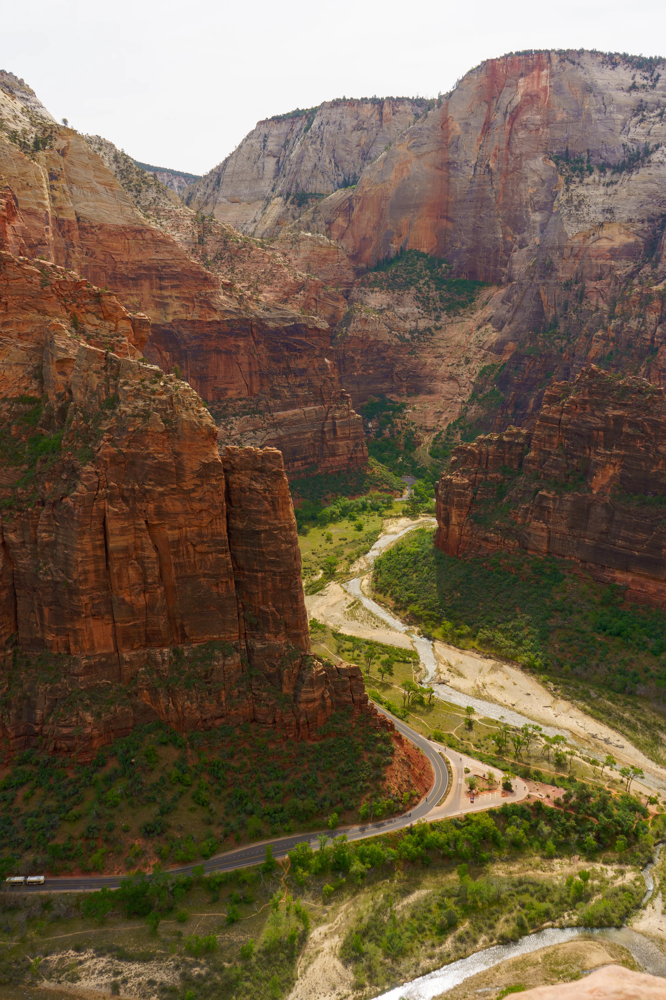

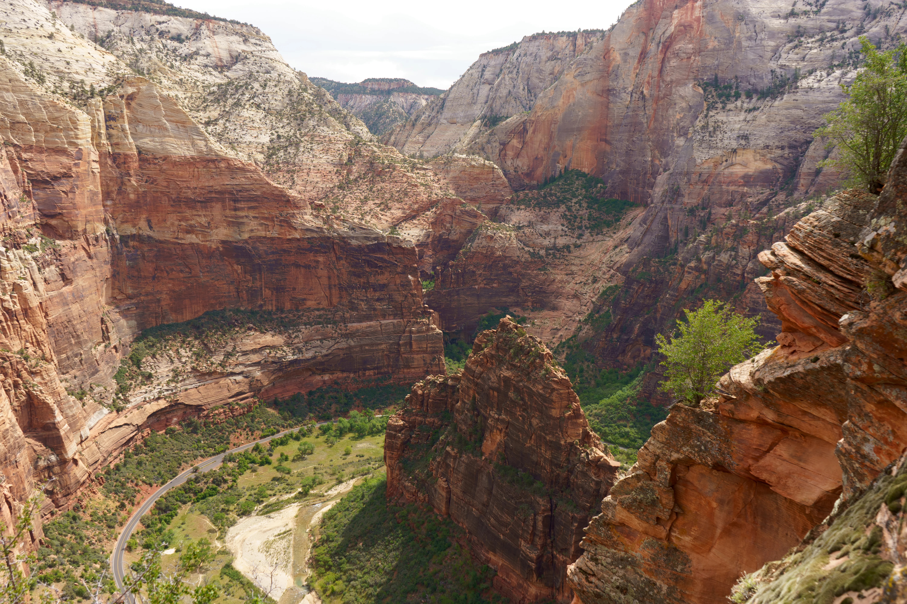

You're definitely _not_ supposed to bring seeds and nuts to feed these bold little chipmunks! (OK but seriously, do some research on what's good for them. Peanuts are not good, for instance. It fattens them up unnecessarily)

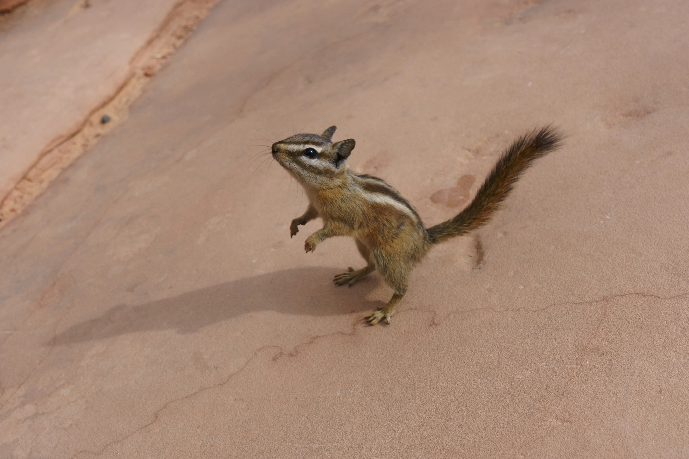

## The Spine

The star of the show, The Spine. A narrow-as-hell path up to the peak of Angel's Landing, with chains all along the way to prevent an otherwise certain death. At most other national parks, the thumb rule is "plan well, otherwise you'll have a hard time". At Zion, you "plan well, or DIE".

Short people are definitely going to have a hard time, ngl. Get good, grippy shoes. Do NOT attempt it when it's wet. And be courteous to oncoming traffic. There are only a few spots where its wide enough to stop and let people pass, so co-operation is the name of the game.

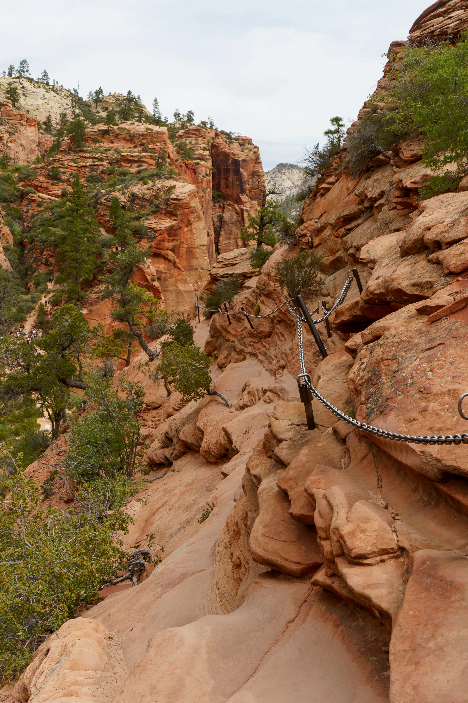  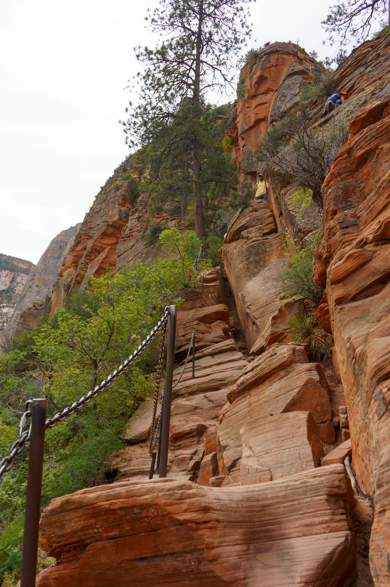

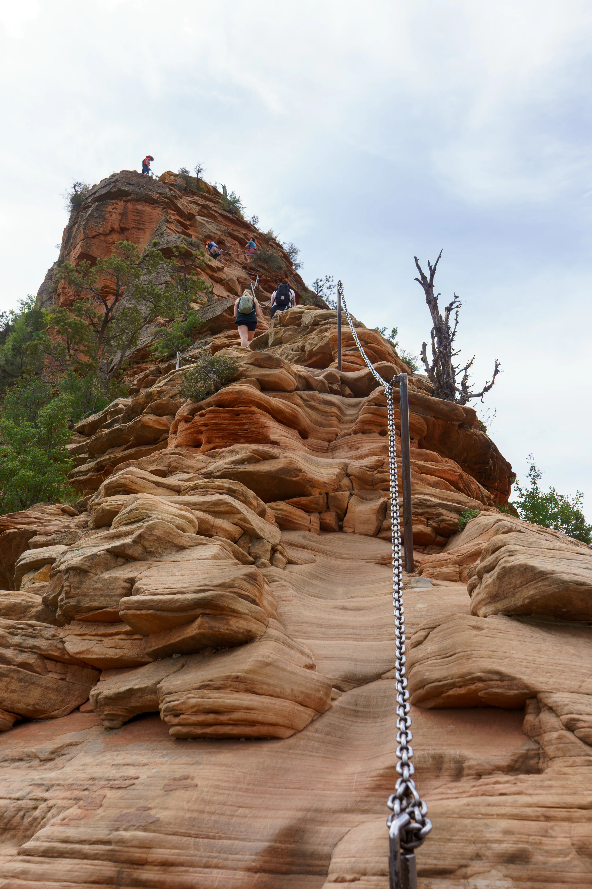

## Them Viewwwws from the top
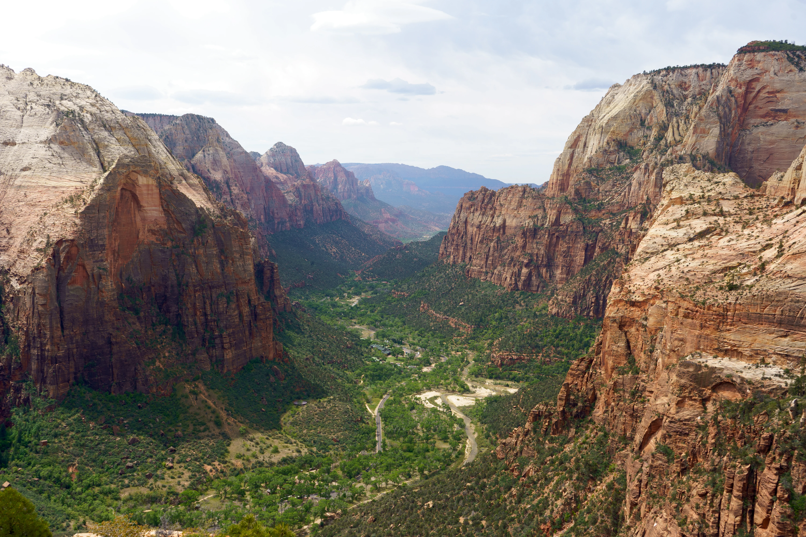

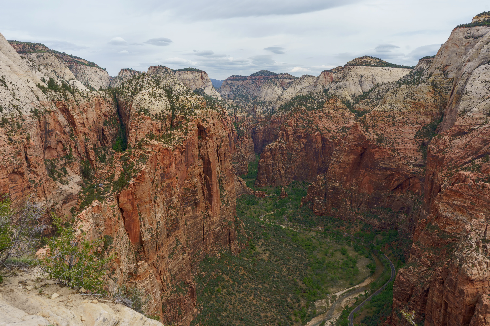