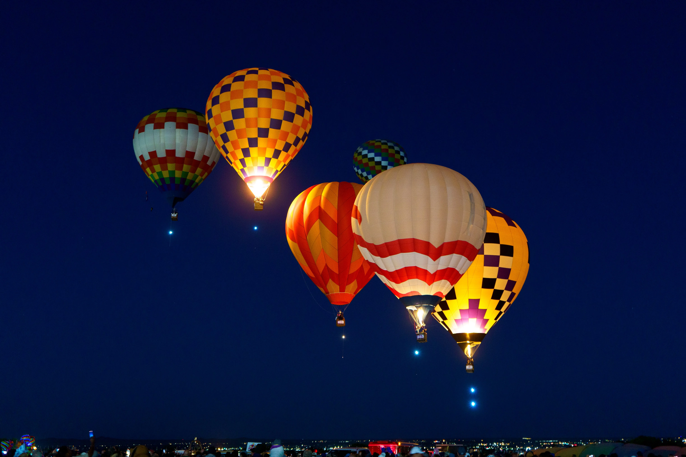
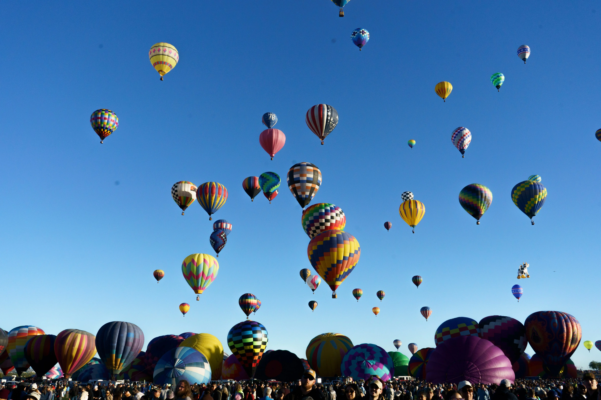
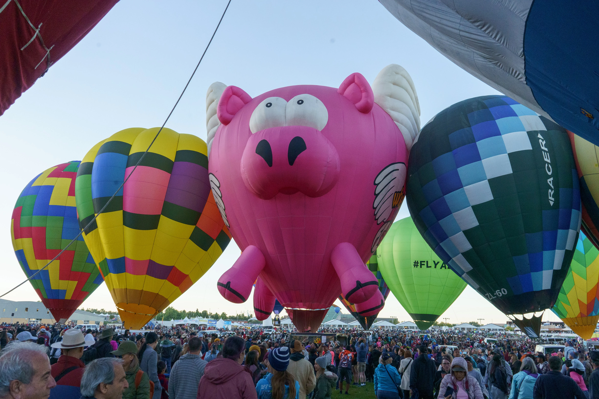
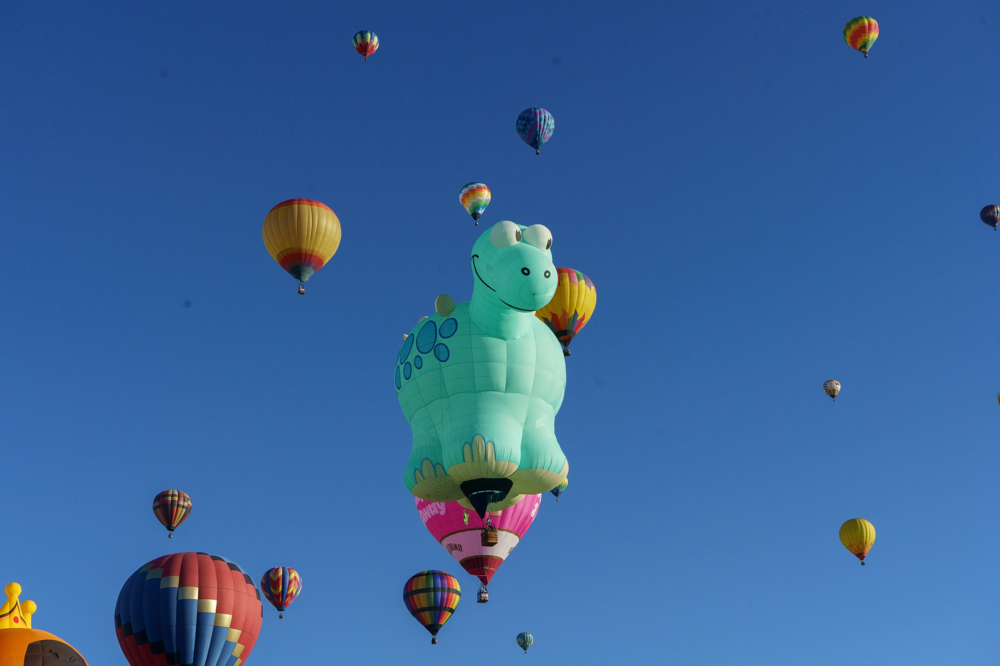
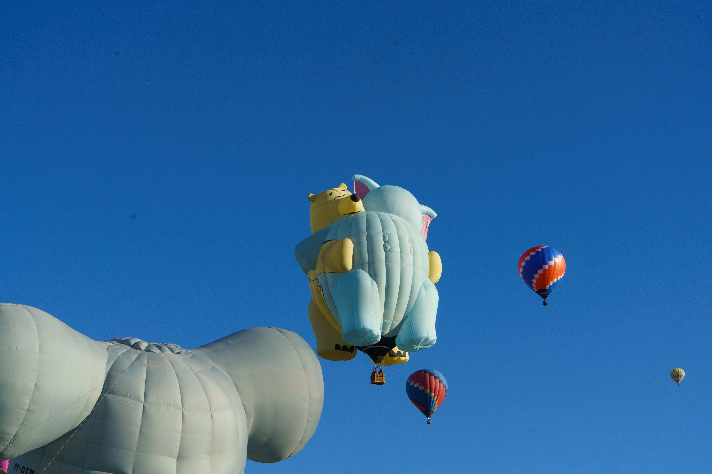
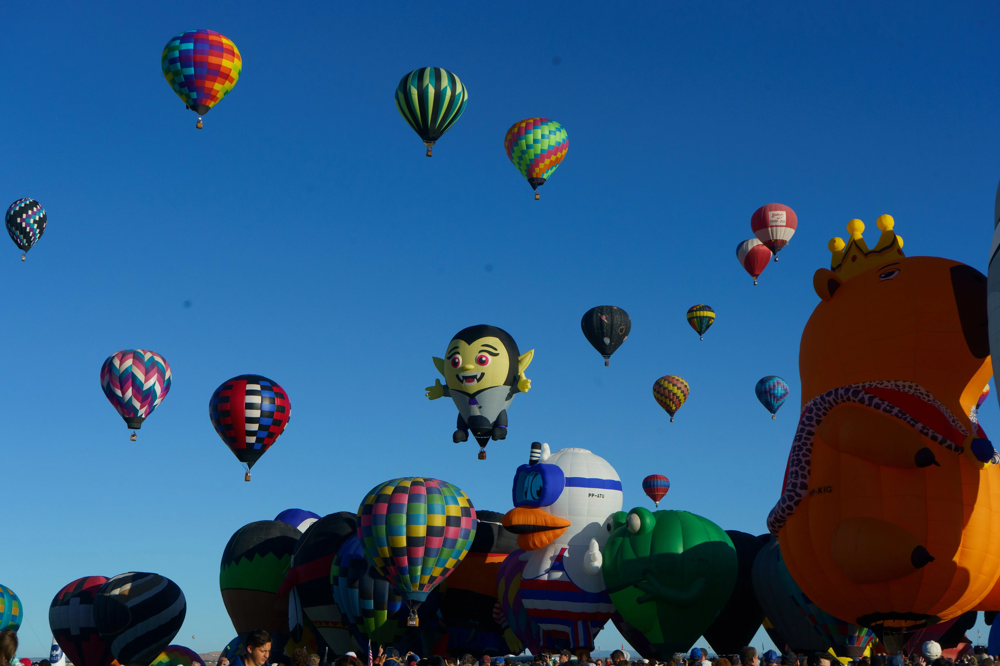
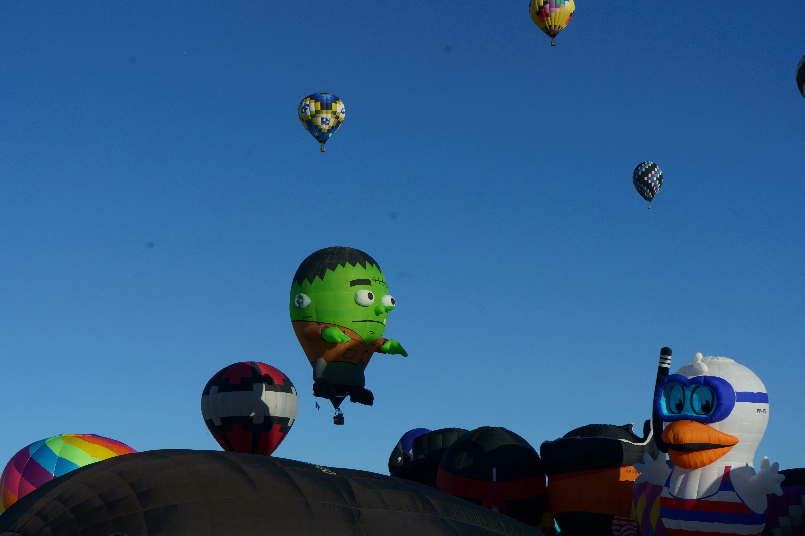
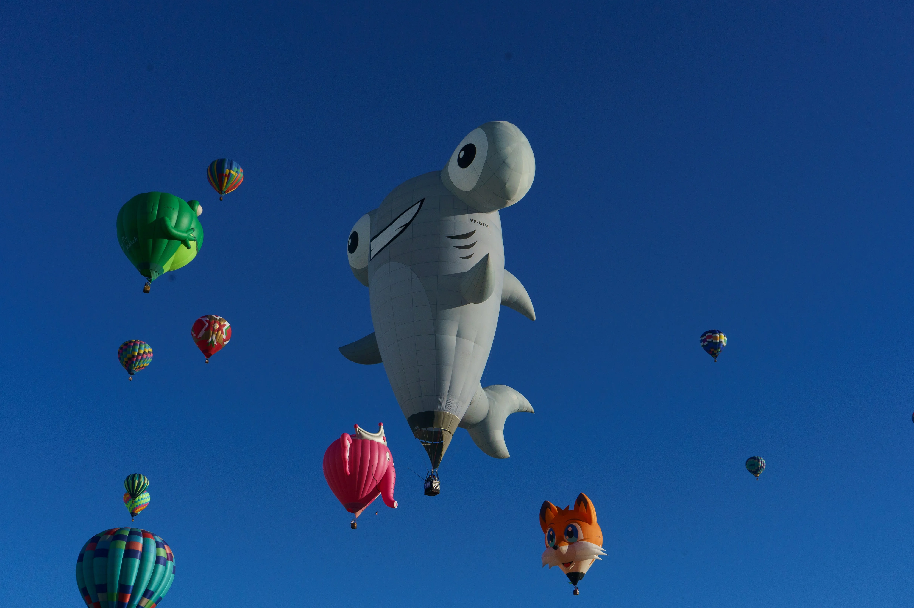
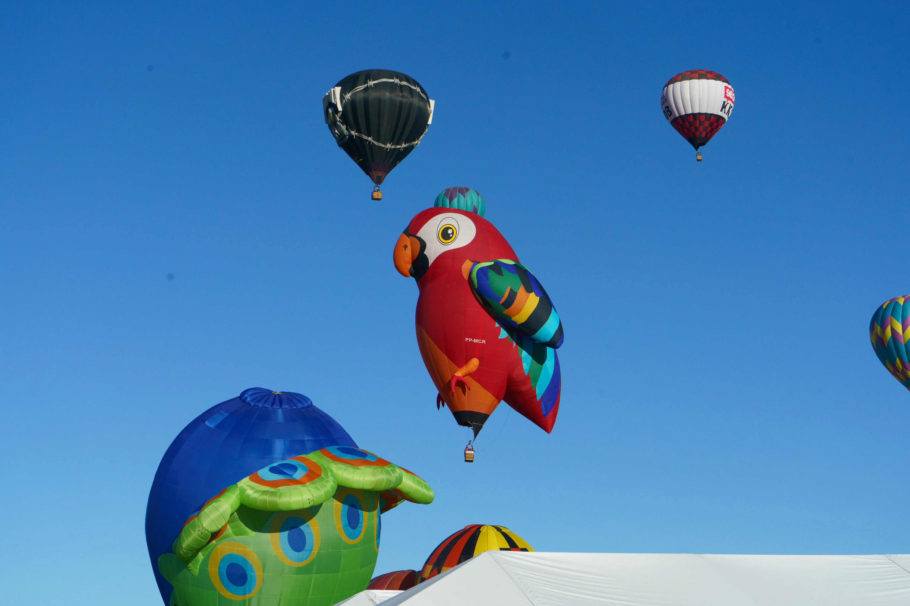

# Highlights
Albuquerque. Before sunrise. \
Hundreds of balloon owners lay out their balloons flat on the ground, and a handful of experienced folks fly up to gauge the wind conditions. If they see favorable wind conditions, they radio it down and a green flag is raised. It has begun!

Around a quarter of the balloons are already up in the air just as the sun rises behind the mountains. 

We the spectators get to walk amongst the balloons, and watch balloon owners inflate their balloons and fly away! The scale of the balloons is hard to convey in a photo, but they are waaay bigger than I imagined in my head!

# More Delightful Balloons
The true beauty of this festival is the myriad of funky balloons that dot the sky! Some are just cute (like birds and capybaras), some are based on popular culture (like Darth Vader), and some are just huge billboards with company names printed on them (unavoidable, but the funding needs to come from somewhere I guess).

> Special thanks to Chaitu, who constantly nagged me to visit Albuquerque every year till I finally did