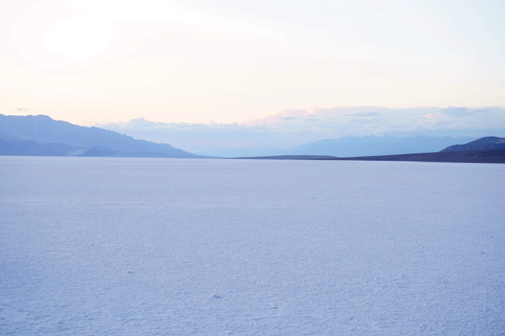
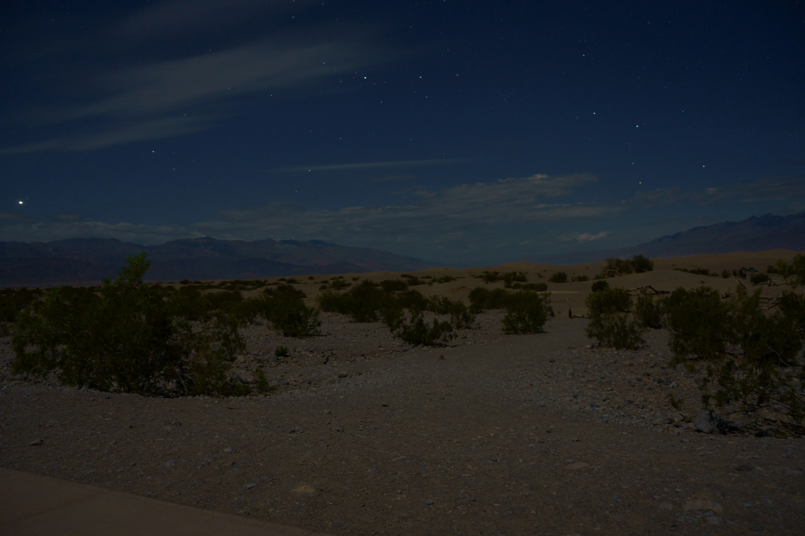
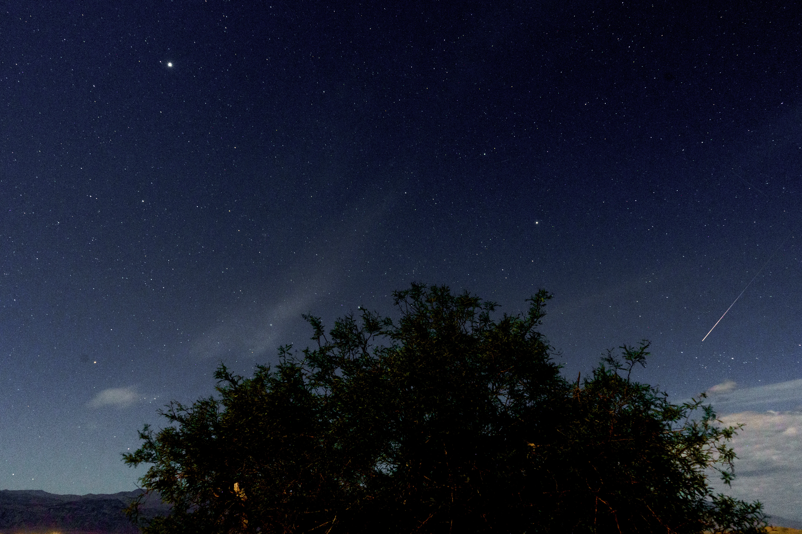
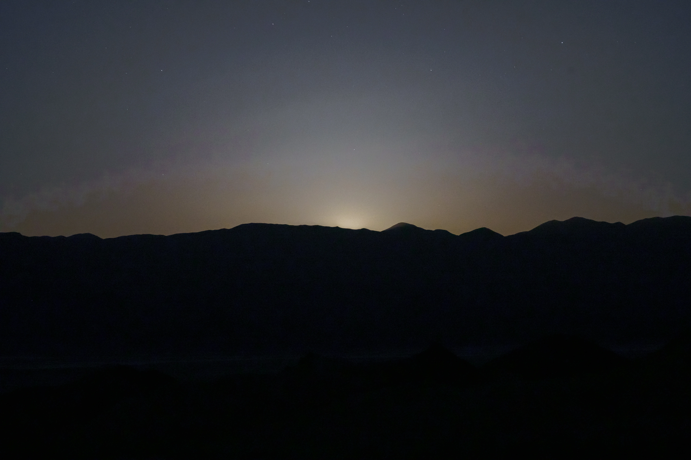
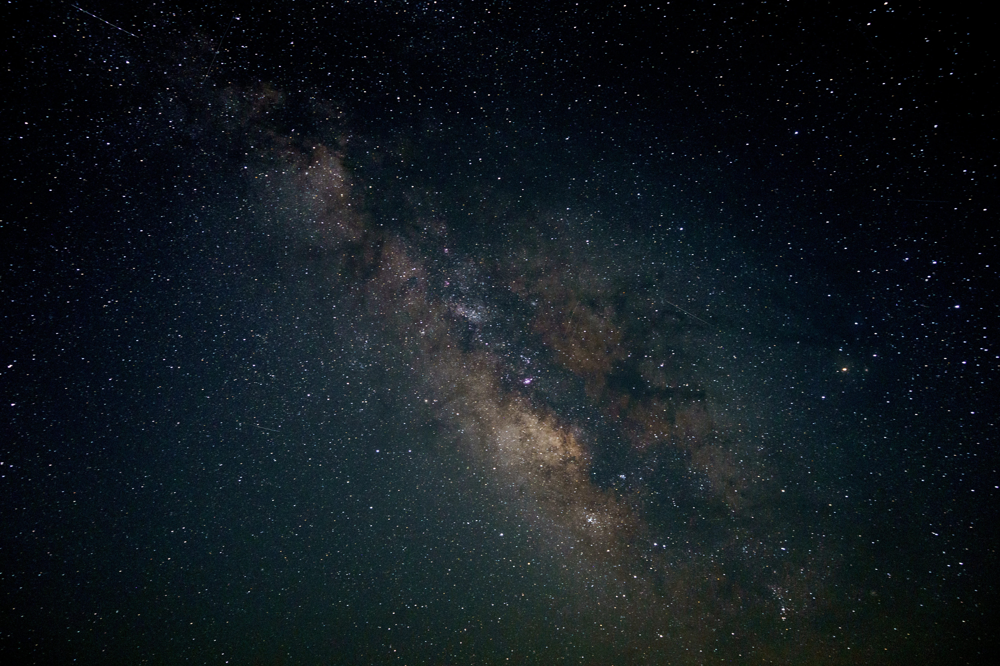
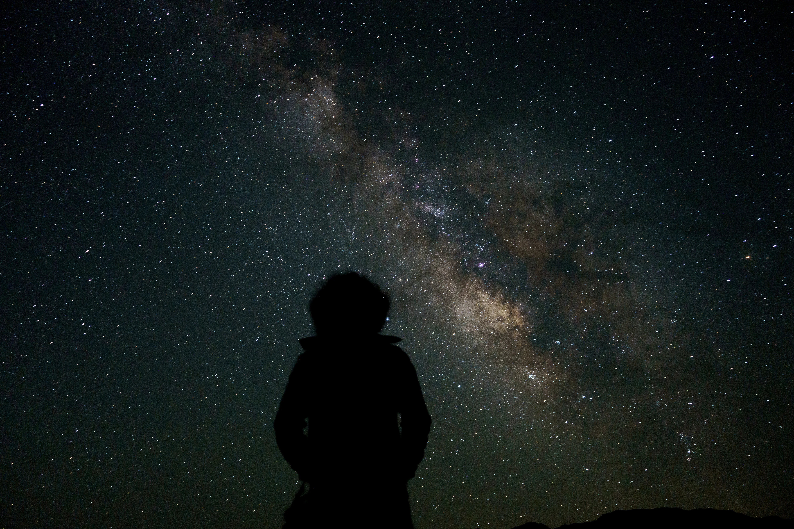
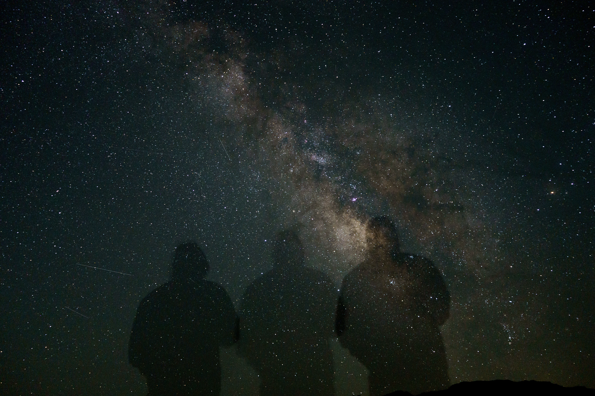

## Badwater Basin
If you're gonna name a place and invite people to visit, maybe this is not the way to go?? Name aside, did not disappoint! This basin is 280 feet below sea level and is formed by tectonic movements pushing this place down. Water from nearby hills acculumates when it rains (which is scant, considering its a desert) and leaves behind salt deposits when it evaporates.

The vastness of this place makes for excellent portrait shots! Make sure to take water with you, as many of the sign boards will remind you. The air is super dry and the salt is kicked up into your face by the strong winds. It leaves your throat dry and itchy without water.

## Mesquite Dunes
The moonlight illuminates the dunes in a really surreal way that sunlight just can't. It's a quiet and haunting landscape, perfect for sitting down on a patch of sand and taking in the wind. Make sure you poke around you with a stick for rattlesnakes before you sit down!!

While the moon does ruin the perfect conditions for star gazing, it helps avoid flashlights, keeping the magic of the desert in the night alive.

We also happened to go on a night where the Lyrid meteor shower is active. You can't see much on the ground, so you'll be forced to point your eyes and your camera up to the sky. You simply can't miss meteors, even when there is no meteor shower going on!! Set your camera on an interval shooting mode, with a good enough exposure, and leave it alone for 30 minutes. The result.... Meteor!

## Zabriskie Point
Now we wait, till the moon sets. Witnessing a moon set behind towering dunes is a unique sight in itself! A goth-sunset, if you will. I imagine a sunset in a distant planet would look like this!

Finally, the moment we had been waiting for. The Milky way makes its entrance!

OK, in all honesty, this is what it actually looks like with the naked eye. You can still very clearly see a cloud spanning the entire sky, but not nearly as bright or colorful. But hey, if you've got a camera capable of capturing long exposures, might as well make use of it right??

.webp)

## People + Milky Way
Combining long exposures with people is usually a recipe for blurred images. But this is night time... a unique opportunity to hide the blurs within the darkness. Make sure you time your milky way viewing properly using a website that tracks milky way rise and set times. You've gotta make sure that the milky way is low in the horizon, but not too low that it is hidden by atmospheric haze. This window needs to coincide with a time when the moon has already set / not yet risen.

Once you've got this recipe locked down, get your tripod out, set the long exposure to around 15 seconds or lesser, and fire away.

If you're feeling a bit adventurous, you can even time your movements during the open shutter to make some cool transparency effects. This shot involved staying still for 5 seconds and moving to a different spot, during a 15 second shutter. You could take it one step further and do some cool dance moves! Urghh if only I had some signal to look up The Dancing Dragon from ATLA :(

