# Part 1 - The Mist Trail
If you go in the right season (June / July), the Vernal fall has a strong enough flow to drench you in mist as you hike the trail near it! Don't miss out on this and end up ascending through the John Muir Trail (JMT)!! You may do that when descending though - it's easier on the knees. But then, you won't get to experience the cool mist after a long day of hiking! Trade-offs. You choose.



Nevada falls has an equally strong flow and its own mist, but the trail is too far from it. We just enjoy the sight of the mist, and once we ascend Nevada falls we can dip our toes in the cool water just before the falls!

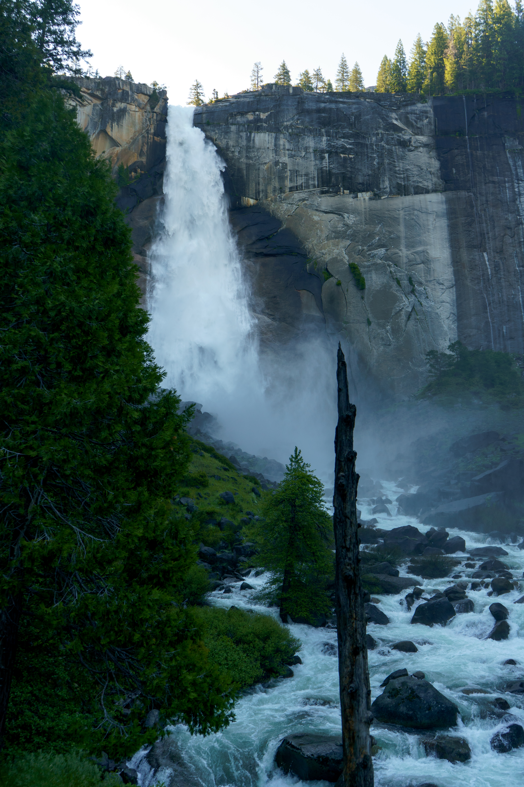

# Part 2 - The Long March through the Forest
Nothing to see here. Literally! You've just gotta power through... just a gentle and long ascent through the forest, with an occasional chance of spotting bears!! We saw one for a brief two seconds as it crossed the trail and disappeared into the trees. If you _really_ want some photos, here's a cute tree I saw with clear distinction between its mature and growing leaves :)

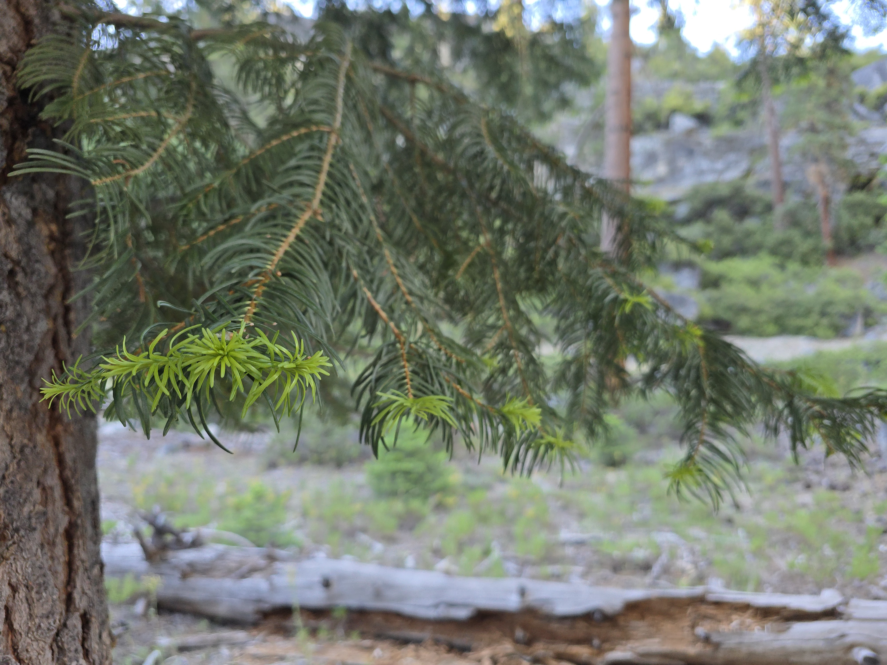

# Part 3 - Sub Dome
Now comes the part no one warned you about. See the big rock just in front of Half Dome? You've gotta scale that first. The first half is a bunch of switchbacks, similar to the Nevada falls ascent, but steeper. The second half is a steep rock face which you may need to scramble over to reach the top! I've highlighted the approximate path in yellow for you.

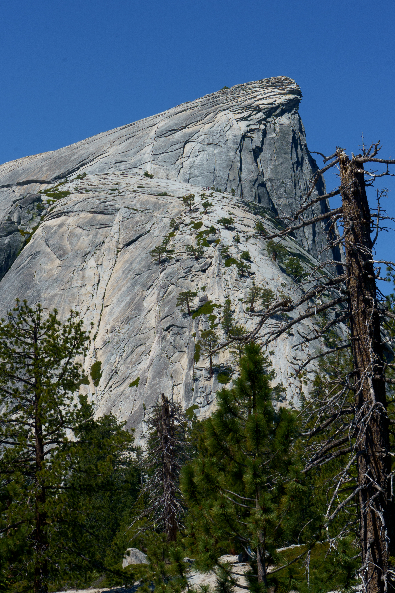  .jpg)

Even regular hikers get winded. Take it slow! Don't compete with those high-achiever trail runners who pass by you saying "on your left"... think they are frickin Captain America or something -_-

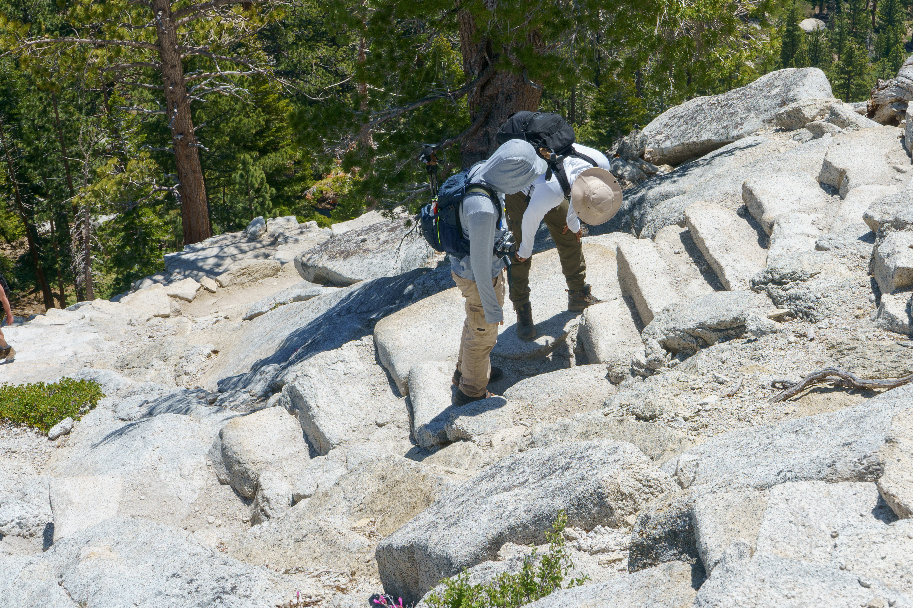

# Part 4 - Half Dome
First reaction - Holy mother of God, I've gotta scale that?!!

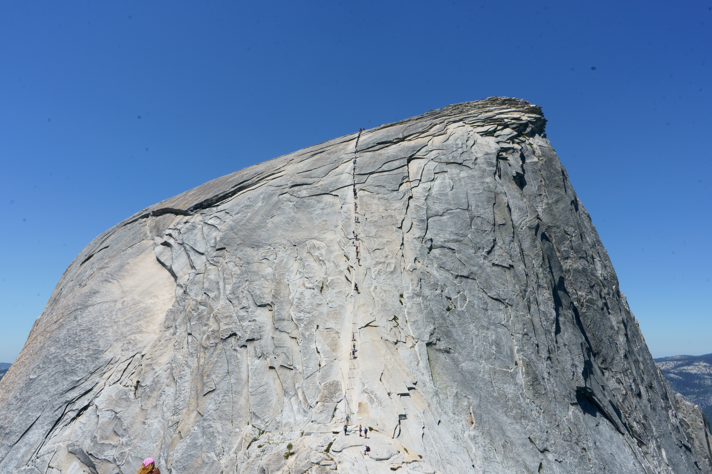

And then you approach it, and you think "OK that doesn't seem so bad??"

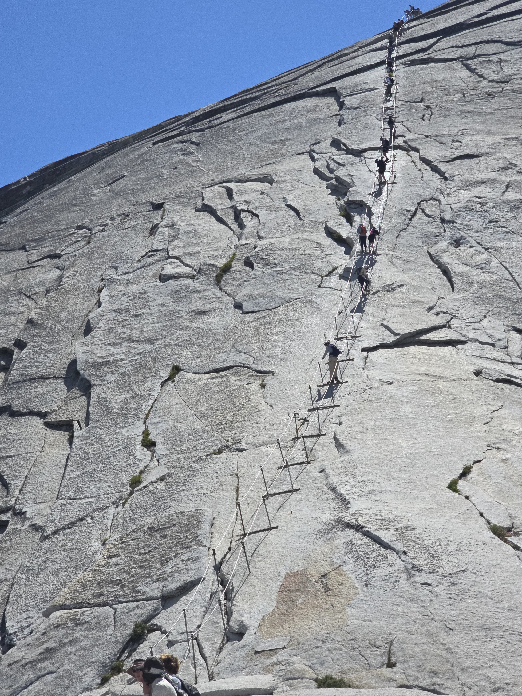

INCORRECT!!! It's steeeep. And the rock is somewhat slippery as well, after decades of people climbing it. See the extra bright, shiny surfaces in the second image?? Slippery rock. 

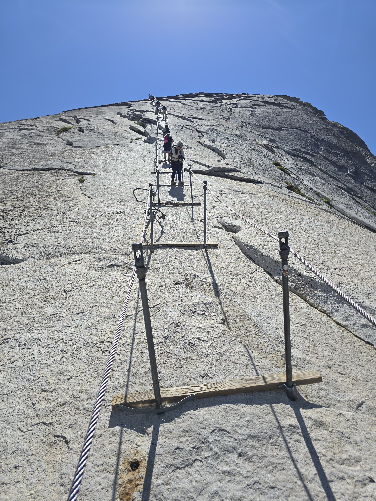  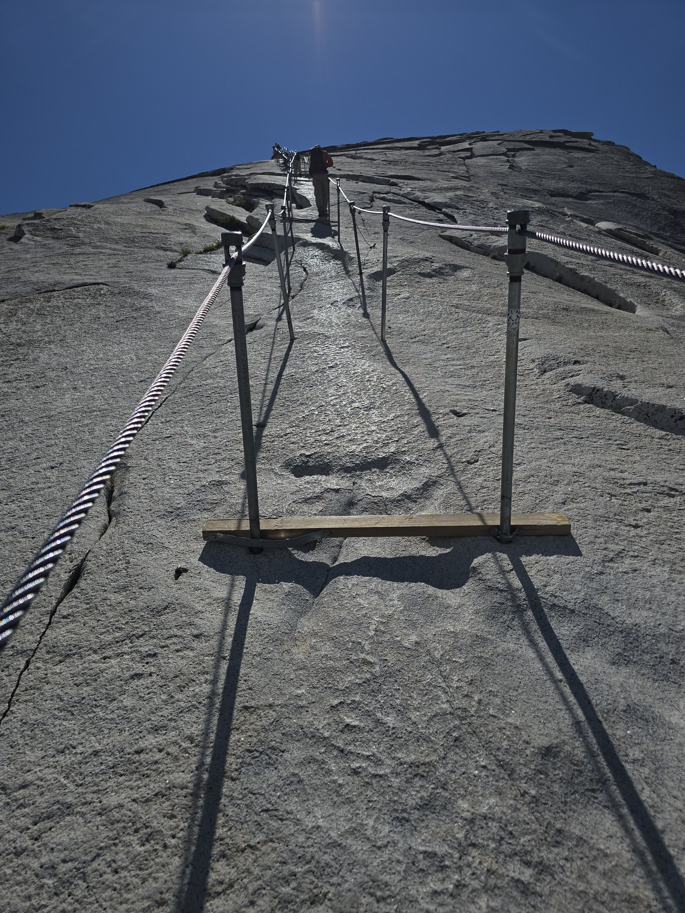

The view from halfway up - mostly dominated by Sub Dome. You conquered the ascent from the valley, and then you conquered Sub Dome. This is what you do. You come, you see, you conquer. Keep going!

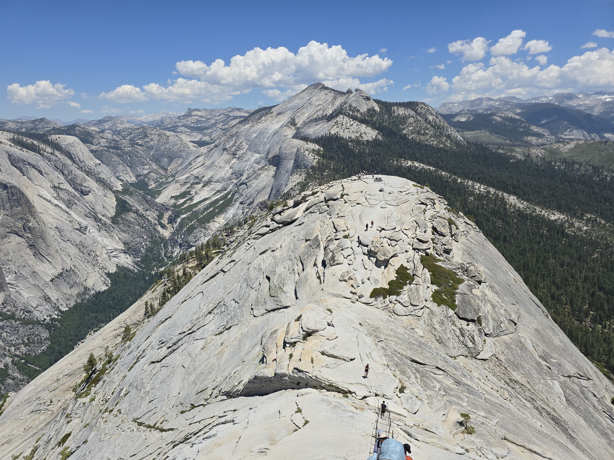

# Now we enjoy the views
The snow covered mountains that feed most of Yosemite's rivers.

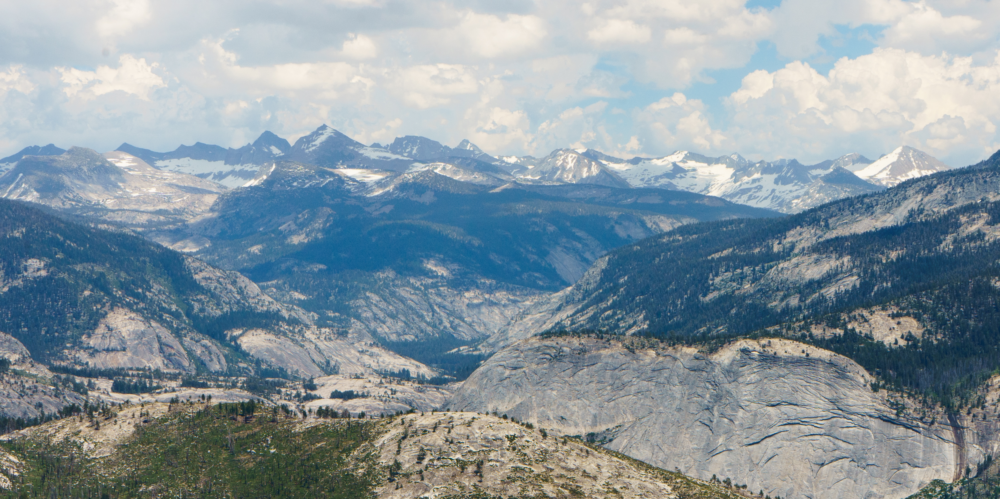

The massive swatches of conifer forests whose trees are quite big, but seem like beard stubble on Yosemite's granite formations. 

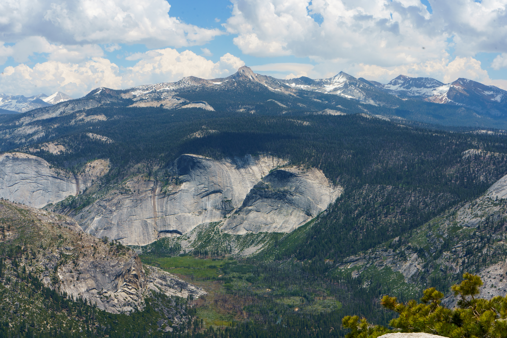

The vast expanses of granite that Yosemite is famous for. Fun fact, when you fly over Yosemite on planes, this is mostly what you'll see.

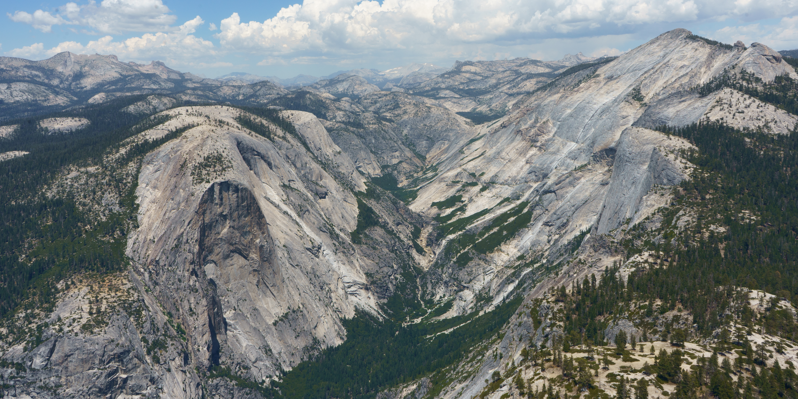

And finally, the Yosemite valley itself. If I had my zoom lens with me, I could have seen Tunnel View. My first ever post looked at Half Dome from Tunnel View. How the tables have turned!

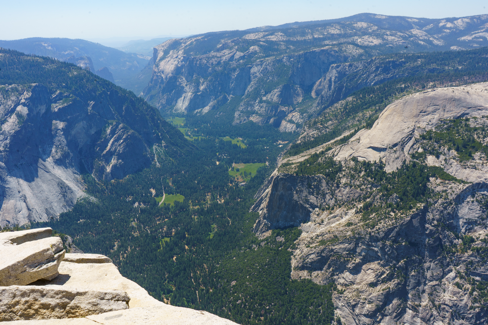
