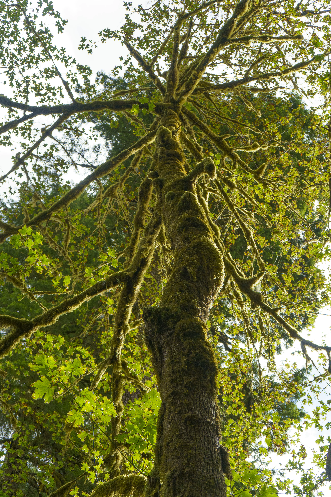
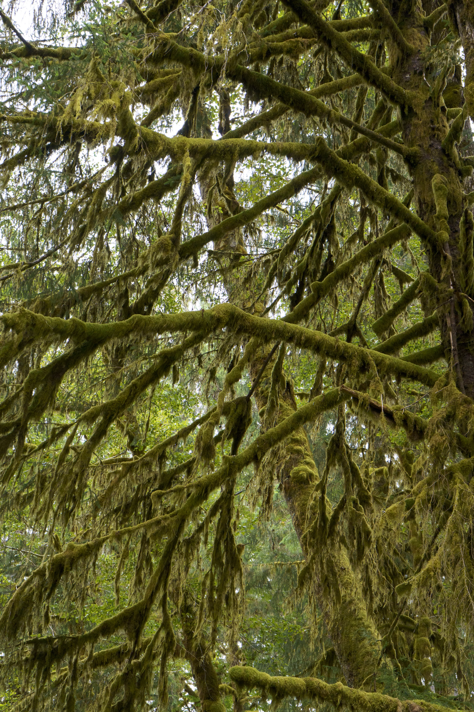
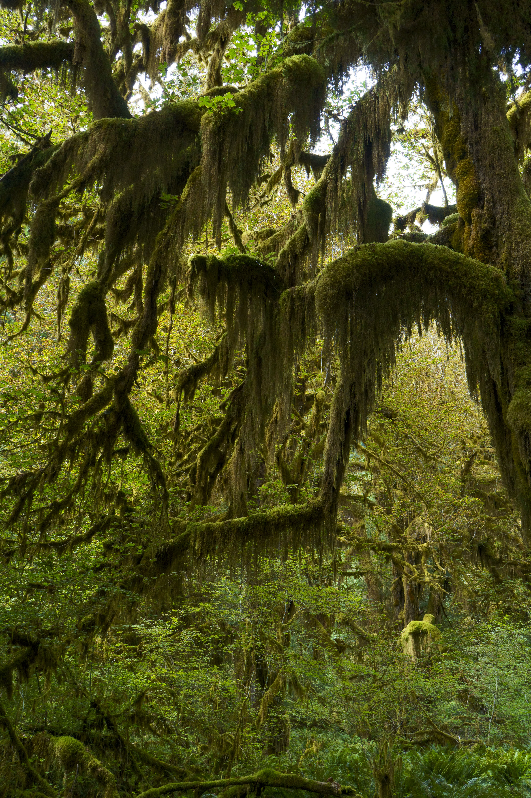
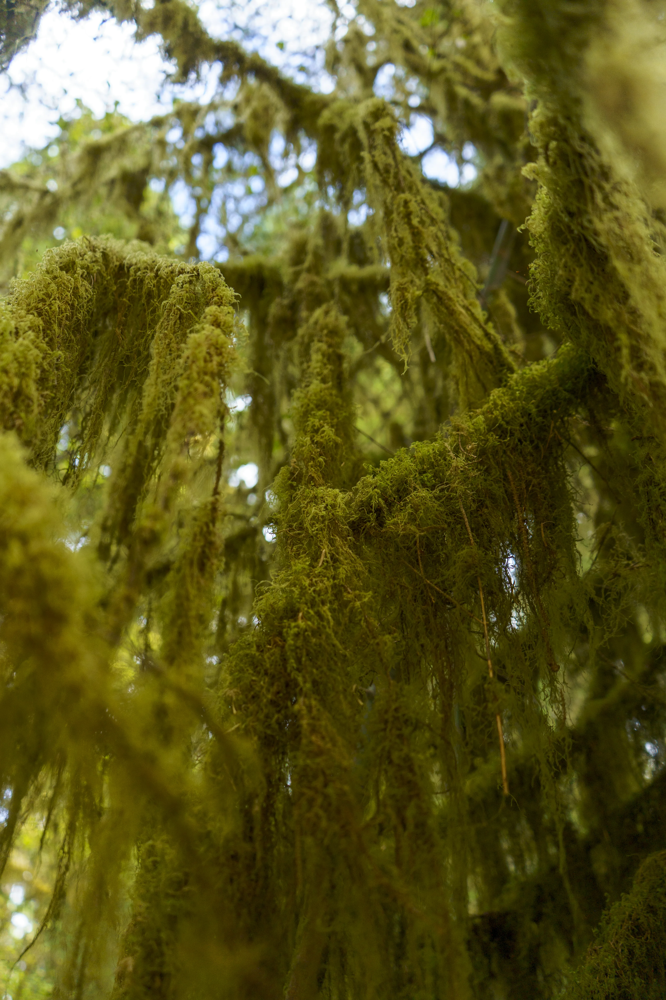
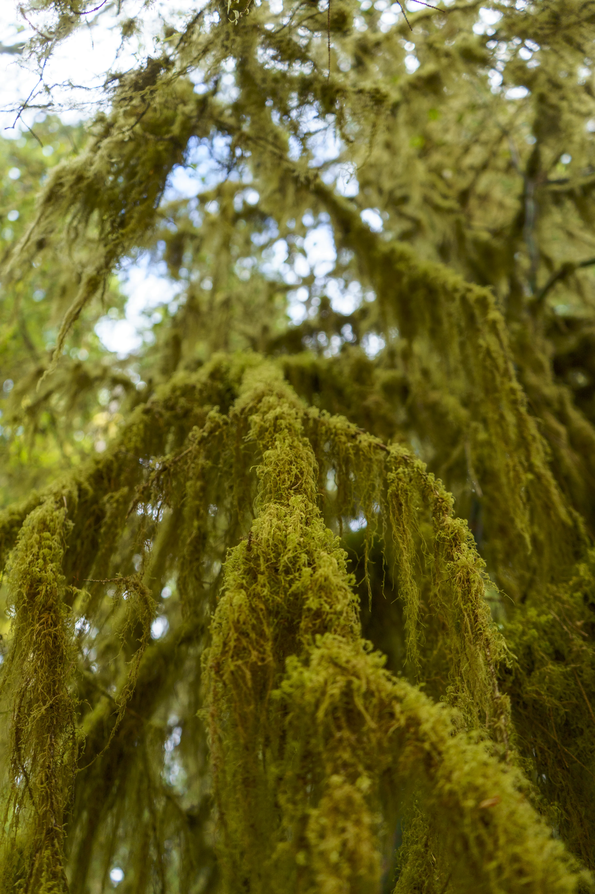
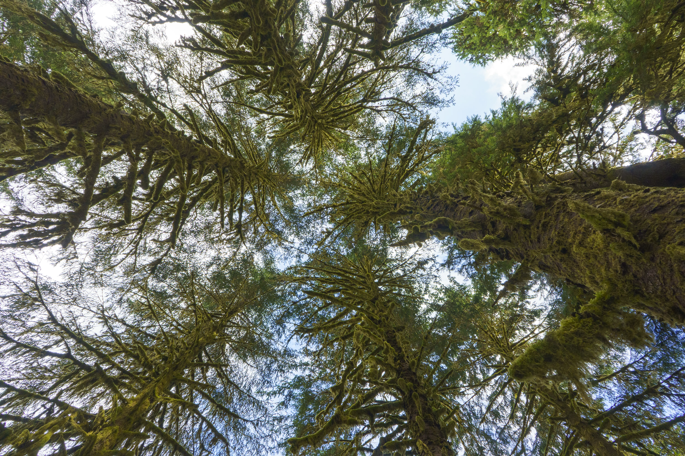
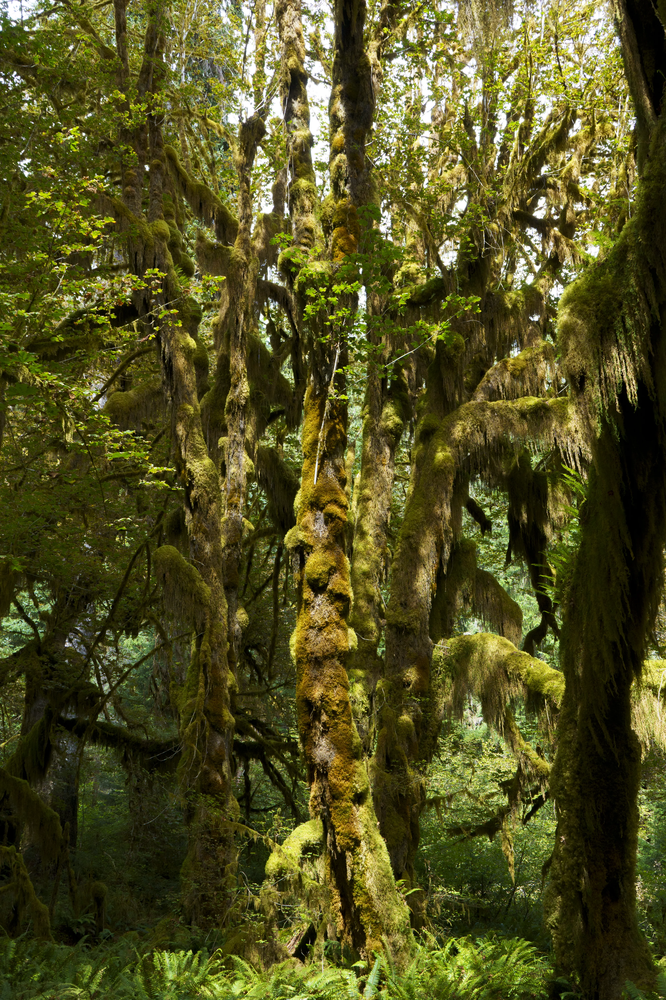
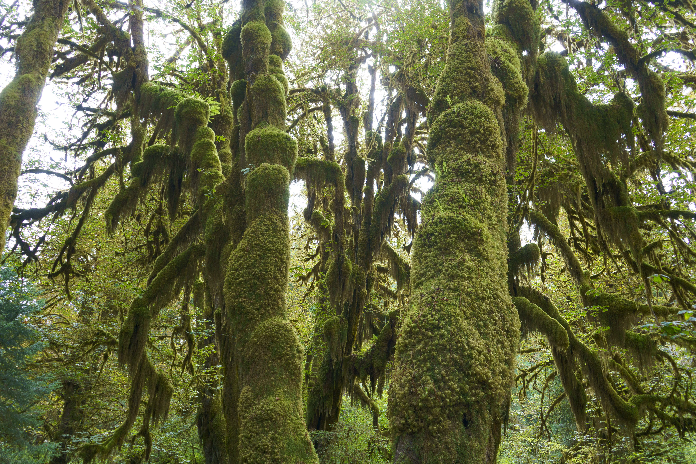
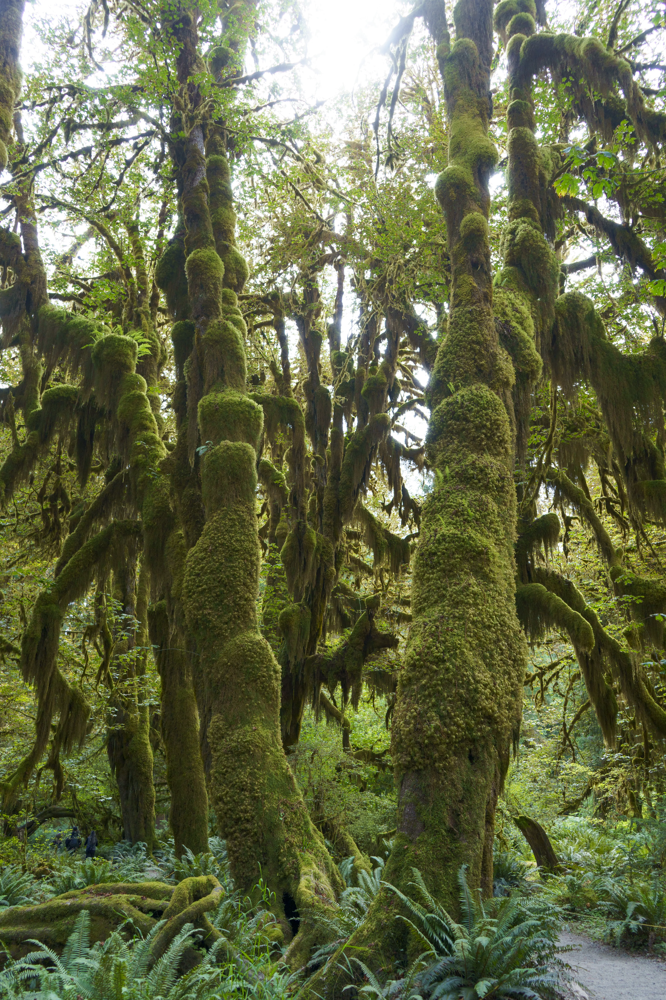

## With a moss moss here

## And a moss moss there

## Here a moss

## There a moss

  

## Everywhere a moss moss

## Hall of mosses had a Grove

## Whoa whoa whoa whoa whoa!

OK, that's enough with the childrens' rhymes! 😅

**FAQs (straight from the park ranger's mouth)**
1. Are the mosses and trees symbiotic?
	- No, and yes. They live on the trees independently, just like birds in their nests. Unlike other symbiotic mosses and lichens, they do not get water and nutrients from the tree, nor do they give photosynthesized products back.  
2. How do they get water then?
	- They are so densely packed like a carpet, and have an almost single-cell thick skin. They either absorb rainwater directly, or suck moisture right out of the air. In fact, they can hold so much water that the rainforest is significantly cooler with mosses than without.
3. Why do trees tolerate this?
	- Their benefit only shows up when they die. Upon decomposing, they effectively form a layer of soil on the tree itself, and the tree branches can sprout roots to tap into this "soil" and get nutrients and water out of it.

Cool right? OK that's all. Byeee!

🎶 E-I-E-I-Oooo 🎶