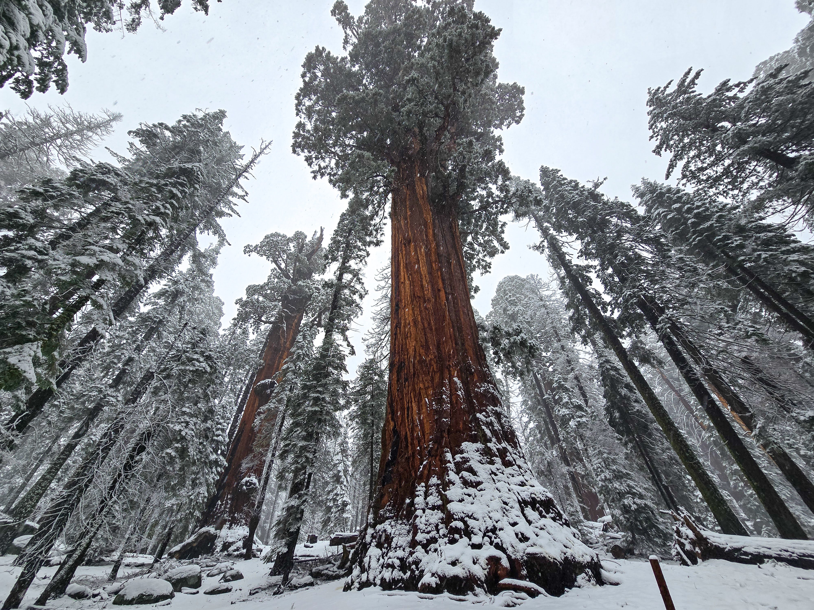
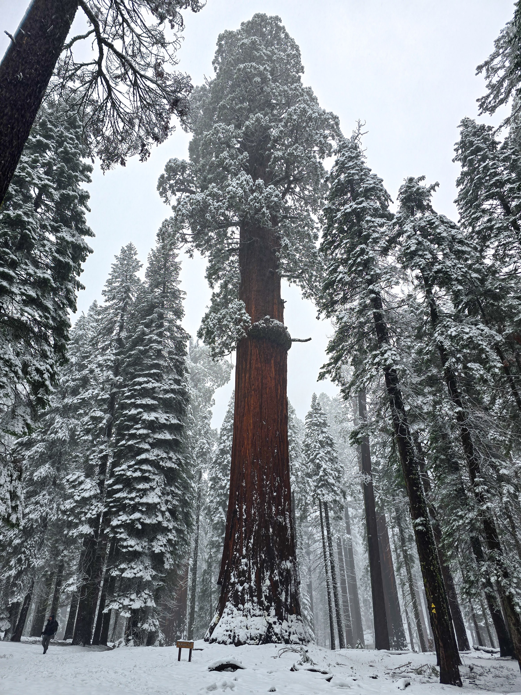
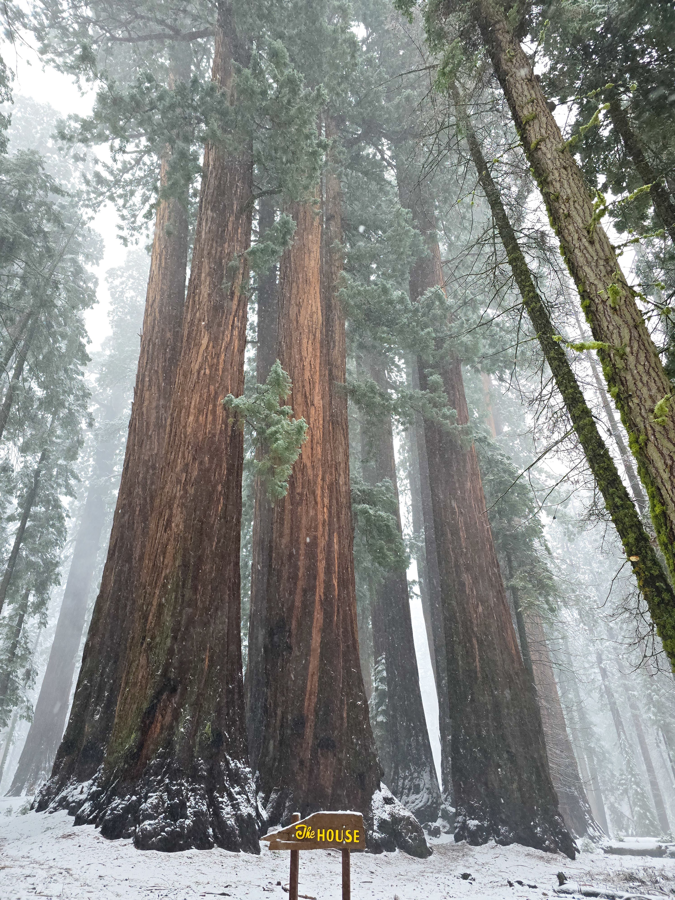
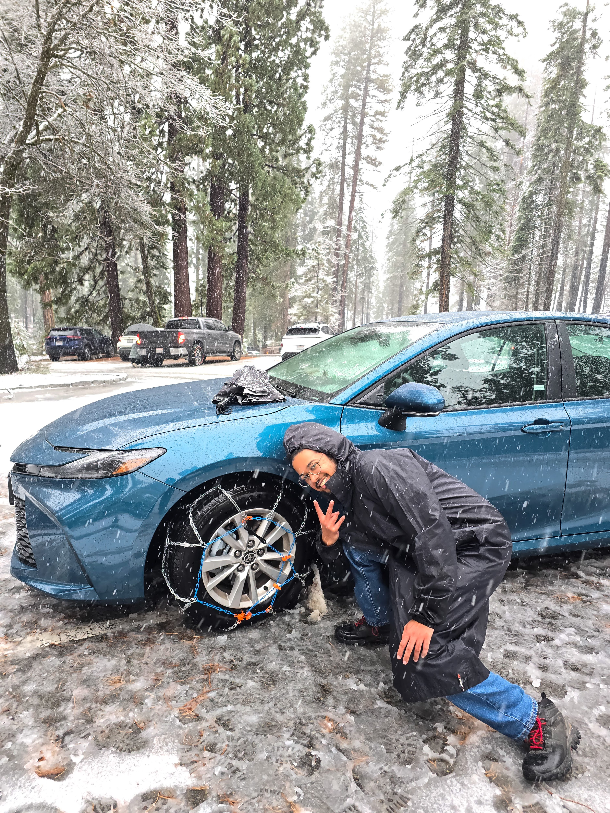

# Highlights

### Puny Human, Giant Trees

They _literally_ touch the sky! When it snows like this, everything else is hidden - small shrubs, grass, flowers. Only the Sequoias stick out and draw your complete attention. Boy did they ever!
### Struck by lightning? Just brush it off
  

A disadvantage to being this tall is that they're often struck by lightning. But these trees are some hardy sons of bitches. Massive hole in their trunk where the wood is burnt off, and they still stand! They're known to take repeated lightning strikes every year and keep chugging along.
### McKinley Tree, the absolute unit of a Sequoia

# Rest of the Journey
### The only Senate I wholly support

### The only House I wholly support

### First time with Snow Chains

My first time putting on snow chains!! Toyota technically doesn't allow snow chains and they recommend snow cables, but these chains were low profile enough. It was easy enough to practice putting them on in my basement. But out in the cold with the snow touching my hands? My red hands speak for themselves T_T

I doubt a 4WD variant of the Camry would've helped avoid snow chains. The roads were super slippery!! Even SUVs and pickups had a hard time navigating uphill sections.