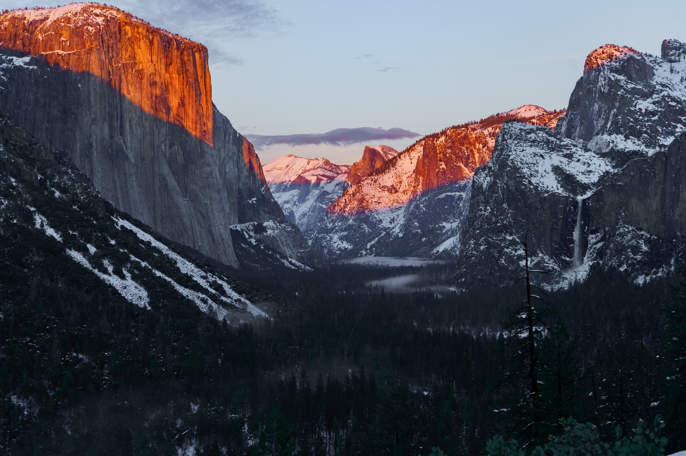
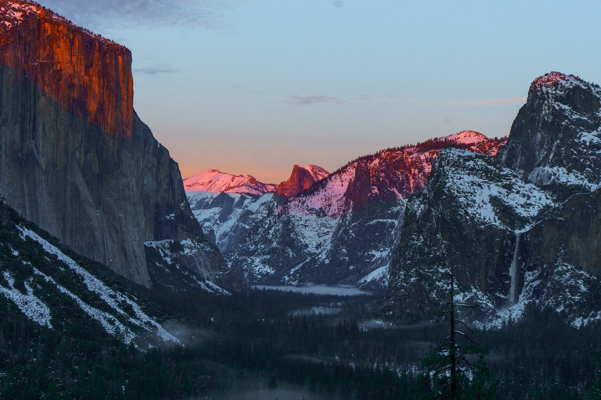
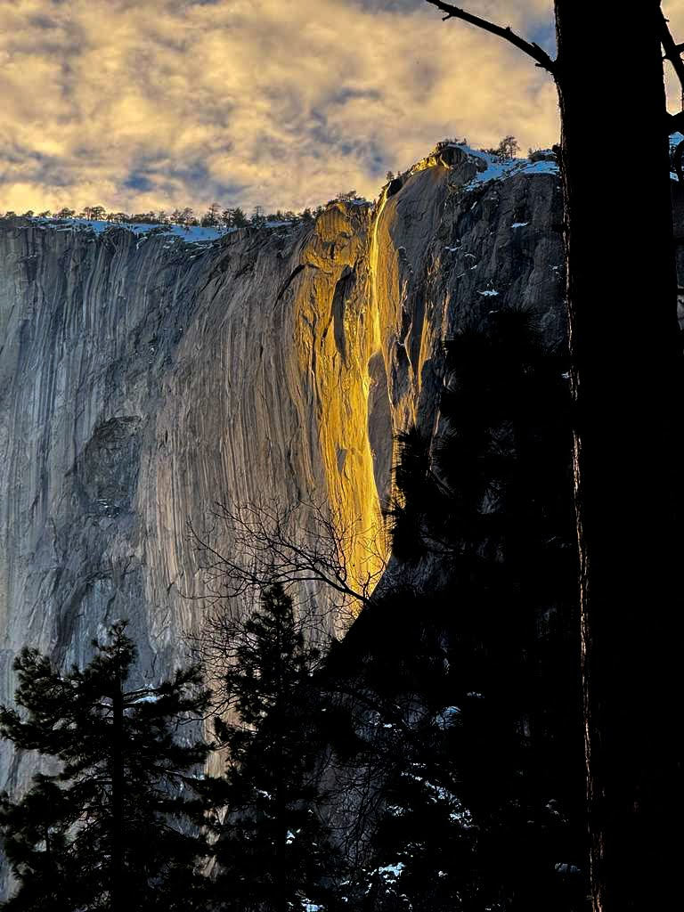
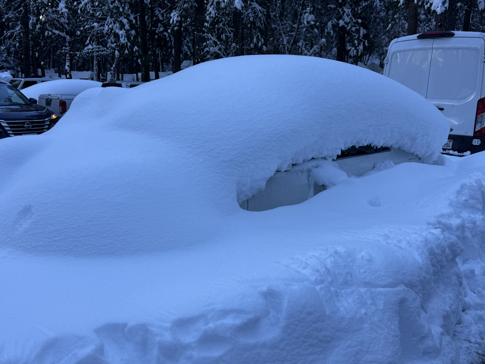
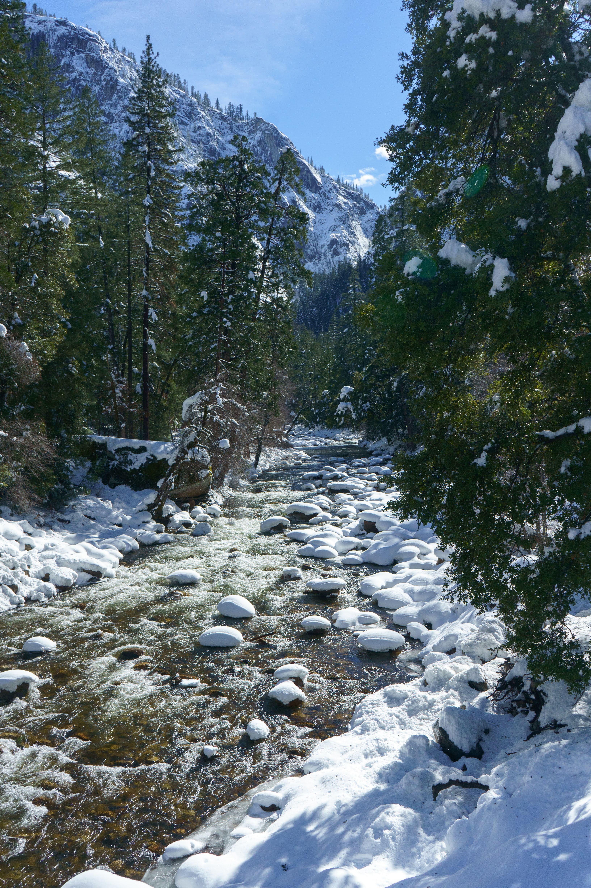
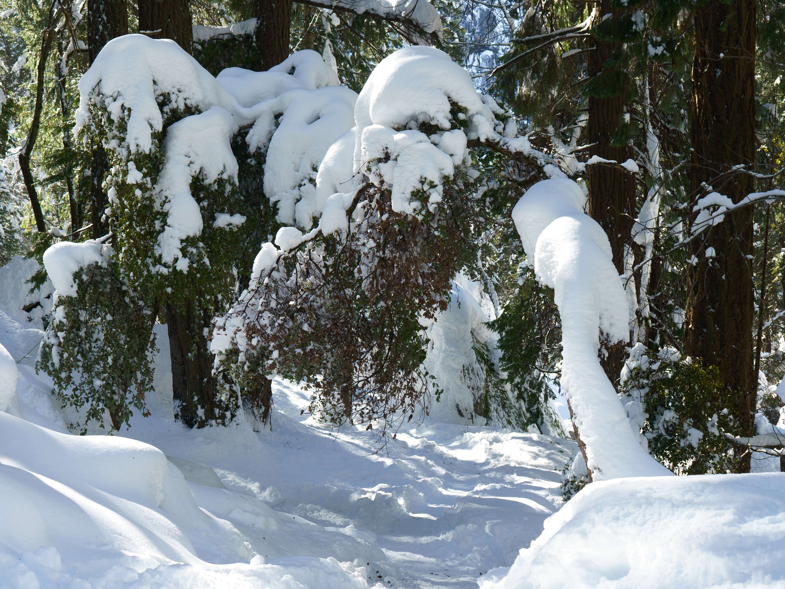

+++
date = '2026-03-06T00:45:03-08:00'
title = 'Yosemite in Winter'
image = 'DSC01489.jpg'
+++

# Highlights

### Tunnel View x Winter Sunset

We came to check out the firefalls and missed it, so we decided to check out tunnel view instead. BEST DECISION EVER.
### Fire Falls! Somewhat...

We underestimated how much traffic there would be for this phenomenon! We missed one of the buses, and decided to do a drive-by and take photos. But we were wayyy too early. Hence the "golden" falls and not "fire" falls. We thought the firefalls would happen ~45 mins before sunset time because we are high up in the mountains. But the sun shines through the valley and illuminates the fire falls late in the evening. Maybe 20-30 minutes before sunset? That was the whole point if I think about it. The rest of the valley is in shade and just the Horsetail Falls is illuminated. Next time! 
 
# Rest of the journey
### Driving through a winter wonderland

Location - Southside drive, Yosemite Valley
Had to put on snow chains for just this part. Rest of the valley was cleared up within a day of the last snow! Good use of NPS funding.

### What was the plan here?

We found this car absolutely covered in snow at the Yosemite Valley parking lot. Yosemite was closed to the public during the snow storm of Feb 16th - Feb 20th, and we went on the 21st. It did not snow on the 21st. You do the math! This car must have been here for a week. What was their big idea? 

### Idlis on the Merced River

Kinda cute, ngl.

### Test your luck

Will a bunch of snow fall on your head when you walk under it? Only one way to find out.
What's that? You want to take a different path? Good luck! Snow is up to your knees anywhere except on the trail.